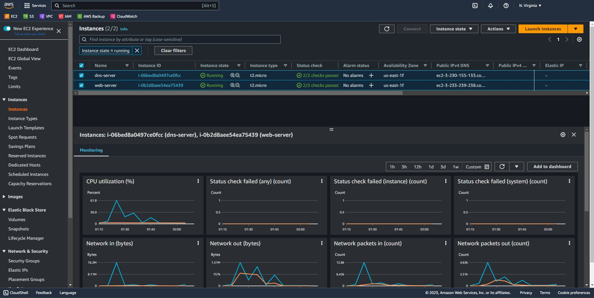
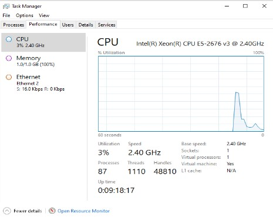
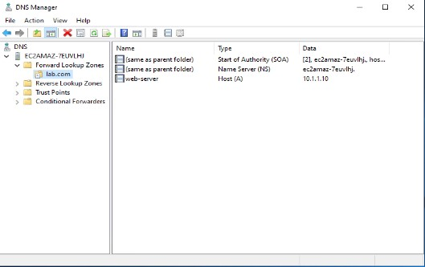
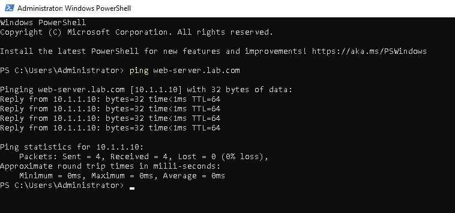
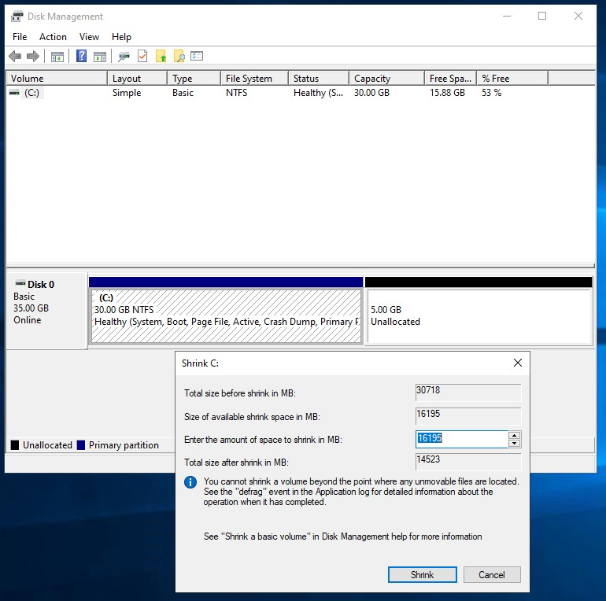
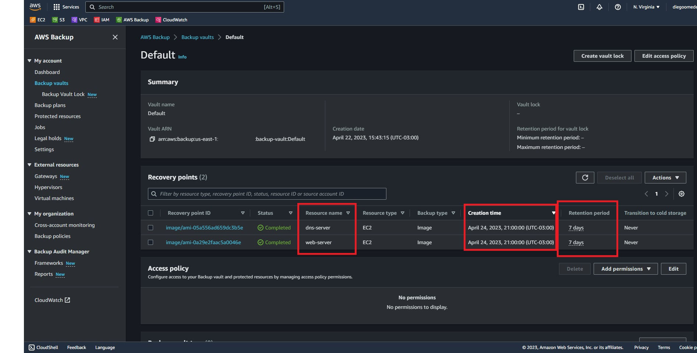
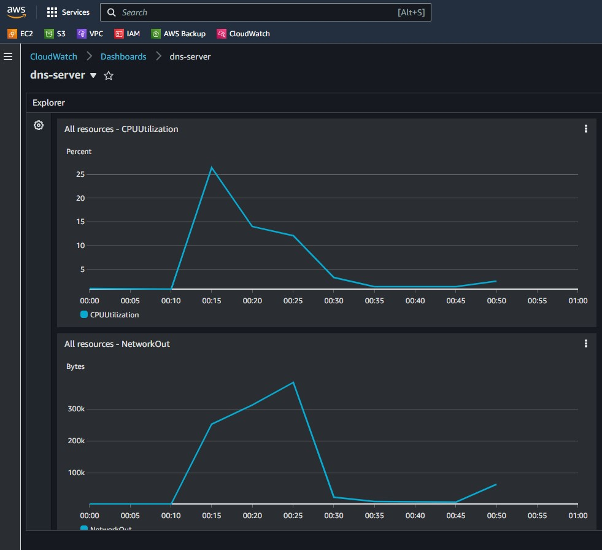
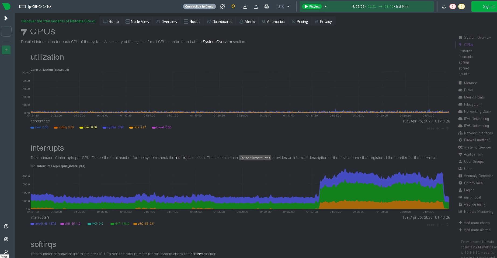
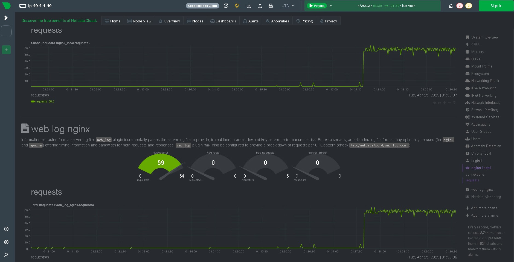
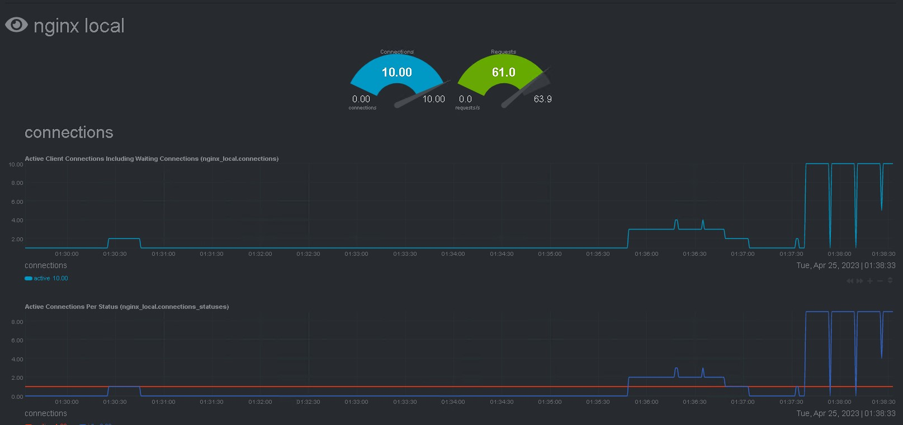

# SYSOPS - Lab

## Lista de tarefas

1 - Criar uma EC2 Linux e disponibilizar a aplicação (/app/index.html).

2 - Criar um servidor Windows e disponibilizar o serviço de DNS.

3 - Reduzir 5GB de disco do servidor Linux online (sem desligar o servidor).

4 - Aumentar 5GB de disco do servidor Windows online (sem desligar o servidor).

5 - Criar uma rotina de Backup para ambos os servidores.

6 - Adicionar monitoramento para ambos os servidores.

## Recursos Necessários
- Ter uma credencial com permissão para manipular EC2, Backup e criação de Role no IAM.
- Ter o Terraform instalado:
https://developer.hashicorp.com/terraform/downloads?product_intent=terraform
- Ter o AWS Cli instalado:
https://docs.aws.amazon.com/cli/latest/userguide/getting-started-install.html

## Antes de começar:

- Configurar o AWS Cli com sua credencial (Access Key e Secret Access Key)
 ```
    aws configure 
 ```
#
##  Terraform - Comandos úteis

Executar comandos :
- `terraform init` para baixar o provider e inicializar o terraform.
- `terraform fmt` para corrigir problema de formatação nos arquivos `.tf` .
- `terraform plan` para criar um plano de execução.
- `terraform apply` para criar a infraestrutura na AWS conforme especificado no plano de execução.
- `terraform output` para rever a lista de variáveis do configurados no Output.
#
## Primeira Tarefa - Criar uma EC2 Linux e disponibilizar a aplicação (/app/index.html).
### Criar arquivos de configuração do terraform:
 ```
 # arquivo aws_provider.tf
 terraform {
  required_providers {
    aws = {
      source  = "hashicorp/aws"
      version = "~> 3.0"
    }
  }
}
# Provider
provider "aws" {
  profile = "default"
  region  = var.region
}
```

### Criar arquivo de variáveis:
```
#Arquivo aws_variaveis.tf
variable "region" {
default     = "us-east-1"
description = "Default Region"
}

variable "instance_type" {
default     = "t2.micro"
description = "Default Instance Type"
}

variable "env" {
default     = "dev"
description = "Default Env Tag Value"
}

variable "vpc_cidr_block" {
default = "10.1.0.0/16"
}

variable "subrede_cidr_block" {
default = "10.1.1.0/24"
}

variable "win_private_ip" {
default = "10.1.1.20"
}

variable "lnx_private_ip" {
default = "10.1.1.10"
}
```
### Criar componentes de Rede:
- VPC 
```
# VPC
resource "aws_vpc" "lab-vpc" {
cidr_block           = var.vpc_cidr_block
enable_dns_hostnames = "true"
tags = {
    env  = var.env
    Name = "lab-vpc"
    }
}
```
- Sub-rede 
```
# Sub-rede Pública
resource "aws_subnet" "lab-subnet-1" {
vpc_id                  = aws_vpc.lab-vpc.id
cidr_block              = var.subrede_cidr_block
map_public_ip_on_launch = "true"
tags = {
    env  = var.env
    Name = "lab-subnet"
    }
}  
``` 
- Internet Gateway
```
# Internet Gateway
resource "aws_internet_gateway" "lab-gw" {
vpc_id = aws_vpc.lab-vpc.id
tags = {
    env  = var.env
    Name = "lab-gw"
    }
}
```
- Tabela de Rotas 
``` 
# Route table 
resource "aws_route_table" "lab-public-rt" {
vpc_id = aws_vpc.lab-vpc.id // Referencia a VPC criada acima
route {
    cidr_block = "0.0.0.0/0"
    gateway_id = aws_internet_gateway.lab-gw.id
}
tags = {
    env = var.env
    Name = "lab-rt"
    }
}
```
- Associação da tabela de rotas com o a subrede
``` 
# Route table e public sub-net
resource "aws_route_table_association" "lab-rt-public-subnet-1" {
subnet_id      = aws_subnet.lab-subnet-1.id
route_table_id = aws_route_table.lab-public-rt.id 
}
```
### Criar o Security Group para Servidor Linux
- Security Group
```
# Security group
resource "aws_security_group" "ssh_http_allowed" {
vpc_id      = aws_vpc.lab-vpc.id  // Referencia a VPC criada acima
name        = "ssh_http_allowed"
description = "Libera entrada de trafego SSH e HTTP e saída"

egress { //Saída liberada
    from_port   = 0
    to_port     = 0
    protocol    = -1
    cidr_blocks = ["0.0.0.0/0"]
}
ingress { //Entrada liberada na porta 22 para toda a internet
    from_port   = 22
    to_port     = 22
    protocol    = "tcp"
    cidr_blocks = ["0.0.0.0/0"]
}
ingress { //Entrada liberada na porta 80 para toda internet
    from_port   = 80
    to_port     = 80
    protocol    = "tcp"
    cidr_blocks = ["0.0.0.0/0"]
}

tags = {
    env = var.env
 }
}
```
### Criar chaves de acesso 
- Key Pair
```
# Criar chave privada.
resource "tls_private_key" "key_pair" {
algorithm = "RSA"
rsa_bits  = 4096
}
# Gera a chave pública.
resource "aws_key_pair" "key_pair" {
key_name   = "lab-key-pair"
public_key = tls_private_key.key_pair.public_key_openssh
}
# Salva a chave privada em um arquivo local para conexao ssh.
resource "local_file" "ssh_key" {
filename = "${aws_key_pair.key_pair.key_name}.pem"
content  = tls_private_key.key_pair.private_key_pem
}
```
### Criar Instância EC2 - Linux  (web-server)
- Selecionar imagem do Ubuntu no AMI
```
data "aws_ami" "ubuntu" {
most_recent = true
owners      = ["099720109477"]
filter {
    name   = "name"
    values = ["ubuntu/images/hvm-ssd/ubuntu-jammy-22.04-amd64-server-*"]
}
}
```
- Criar interface de rede e assinar  IP fixo e SG
```
resource "aws_network_interface" "lnx_interface" {
subnet_id       = aws_subnet.lab-subnet-1.id
private_ips     = [var.lnx_private_ip]
security_groups = [aws_security_group.ssh_http_allowed.id]
}
```
- Criar a Instância Linux  
```
# Instancia EC2 - Linux
resource "aws_instance" "web-server" {
ami           = data.aws_ami.ubuntu.id
instance_type = var.instance_type
tags = {
    Name   = "web-server"
    env    = var.env
    Backup = true
}

network_interface {
    network_interface_id = aws_network_interface.lnx_interface.id
    device_index         = 0
}
## Unidade Extra
ebs_block_device {
    device_name           = "/dev/xvdc"
    volume_size           = 25
    volume_type           = "gp2"
    delete_on_termination = true
}
#monitoring             = true
# Chave publica para SSH 
key_name = aws_key_pair.key_pair.key_name

# Instalação do nginx
# Arquivo que será executado na instancia
provisioner "file" {
    source      = "linux_config.sh"
    destination = "/tmp/linux_config.sh"
}

# Executando o arquivo linux_config.sh
provisioner "remote-exec" {
    inline = [
    "chmod +x /tmp/linux_config.sh",
    "sudo /tmp/linux_config.sh"
    ]
}
# Setup de conexao ssh para execucao do script linux_config.sh
connection {
    type        = "ssh"
    host        = self.public_ip
    user        = "ubuntu"
    private_key = file("${aws_key_pair.key_pair.key_name}.pem") 
    }
}
```
- Script de configuração das aplicações/serviços:
```
# linux_config.sh
#!/bin/bash
# sleep until instance is ready
until [[ -f /var/lib/cloud/instance/boot-finished ]]; do
sleep 1
done
# instalar nginx e git
apt-get update
apt-get -y install nginx git

# Clona repo na instância e copia app para pasta site default
git clone https://github.com/GitJMSeguradora/sysops-teste.git
cp ./sysops-teste/app/* /var/www/html/

# Garante que o servidor esta iniciado
service nginx start

# config provisória de servidor DNS
sudo sed -i '/nameserver 127.0.0.53/i \nameserver 10.1.1.20 \' /etc/resolv.conf
```
Telas


#
## Segunda tarefa - Criar um servidor Windows e disponibilizar o serviço de DNS.
### Criar o Security Group
```
# Security group
resource "aws_security_group" "rdp_allowed" {
vpc_id      = aws_vpc.lab-vpc.id
name        = "RDP_allowed"
description = "Allow RDP inbound traffic and full outbound"

egress { #Saida liberada
    from_port   = 0
    to_port     = 0
    protocol    = -1
    cidr_blocks = ["0.0.0.0/0"]
}
ingress { #Entrada liberada na porta 3389 para toda a internet
    from_port   = 3389
    to_port     = 3389
    protocol    = "tcp"
    cidr_blocks = ["0.0.0.0/0"]
}
ingress { #Entrada DNS TCP subrede
    from_port   = 53
    to_port     = 53
    protocol    = "tcp"
    cidr_blocks = ["10.1.1.0/24"]
}
ingress {#ENtrada  DNS UDP subrede
    from_port   = 53
    to_port     = 53
    protocol    = "udp"
    cidr_blocks = ["10.1.1.0/24"]
}
ingress { #Libera icmp na subrede
    from_port   = -1
    to_port     = -1
    protocol    = "icmp"
    cidr_blocks = ["10.1.1.0/24"]
}
tags = {
    env = var.env
    }
}
```
### Criar Instância EC2 - Windows
- Selecionar imagem Windows no AMI
```
data "aws_ami" "windows-2022" {
most_recent = true
owners      = ["amazon"]
filter {
    name   = "name"
    values = ["Windows_Server-2022-English-Full-Base*"]
    }
}
```
- Criar interface de rede com IP fixo e respectivo SG
```
#Interface de Rede com ip fixo e sg.
resource "aws_network_interface" "win_interface" {
subnet_id       = aws_subnet.lab-subnet-1.id
private_ips     = [var.win_private_ip]
security_groups = [aws_security_group.rdp_allowed.id]
}
```
- Criar script Powershell para configuração do SO e ativação do DNS Server
```
# PowerShell Script
data "template_file" "windows-userdata" {
template = <<EOF
    <powershell>
    # Instala DNS Server
    Install-WindowsFeature -Name DNS -IncludeManagementTools ;
    # Configura Zona LAB.COM
    Add-DNSServerPrimaryZone -name lab.com -Zonefile lab.com.DNS -DynamicUpdate NonsecureAndSecure
    # Adiciona entrada DNS tipo A para o servidor web-server (linux)
    Add-DNSServerResourceRecordA -name web-server -Zonename lab.com -AllowUpdateAny -IPv4Address "${aws_instance.web-server.private_ip}"
    # Incluindo o proprio servidor como DNS primário.
    $index = Get-NetIPAddress | Where-Object -FilterScript { $_.IPv4Address -eq "${var.win_private_ip}"} | Select-Object -Property InterfaceIndex
    Set-DnsClientServerAddress -InterfaceIndex $index.InterfaceIndex -ServerAddresses ("${var.win_private_ip}")
    </powershell>
EOF
}   
```
- Criar Instância Windows
```
resource "aws_instance" "dns-server" {
ami           = data.aws_ami.windows-2022.id
instance_type = var.instance_type
tags = {
    Name = "dns-server"
    env  = var.env
}
network_interface {
    network_interface_id = aws_network_interface.win_interface.id
    device_index         = 0
}
# root disk
root_block_device {
    volume_size           = 30
    volume_type           = "gp2"
    delete_on_termination = true
    encrypted             = true
}
#monitoring             = true
# the Public SSH key
key_name = aws_key_pair.key_pair.key_name
#Exec powershell
user_data = data.template_file.windows-userdata.rendered

}
```
Telas

Todas as instâncias criadas


T2Micro



Servidor DNS



Ping no registro A criado no servidor DNS


#
## Terceira tarefa - Reduzir 5GB de disco do servidor Linux online (sem desligar o servidor)

Não é possível reduzir armazenamento EBS sem desligar a instância - apenas expandir. Outros tipos de armazenamento passíveis de utilização com EC2 (EFS, S3, FSx) são elásticos e não possuem valor ajustável. https://docs.aws.amazon.com/AWSEC2/latest/UserGuide/requesting-ebs-volume-modifications.html

Exemplo de tentativa via aws cli:
```
aws ec2 modify-volume --size 5 --volume-id vol-029f4b7bd3bb4f61f

An error occurred (InvalidParameterValue) when calling the ModifyVolume operation: New size cannot be smaller than existing size
```

Para atingir tal objetivo e supondo que o ajuste deva ser realizado em um volume de armazenamento dados (que não seja o volume utilizado pelo sistema operacional), deve ser incluído um novo volume com tamanho desejado (no caso, 5GB a menos) para movimentar os dados. Caso seja necessário realizar no volume do SO, haverá desligamento logo não corresponde à premissa da tarefa.
Para realizar, entre as variadas opções para movimentação de dados entre discos, destaco as seguintes opções:
- Com ambos discos e partições montadas, instância e sistema operacional respectivamente, copiar os arquivos entre eles (utilizando o comando `cp -rp source-dir/ dest-dir/` por exemplo) e, após finalizado, apontar os serviços para os respectivos  diretórios no novo disco.
- Utilizar a ferramenta de cópia de dados `dd` para clonar os dados entre as partições - ideal que seja feito com as partições desmontadas.
    - Exemplo de uso:
   
        `dd if=/dev/sda of=/dev/sdb bs=4096 conv=notrunc,noerror`
        
        `if=/dev/sda` especifica a origem dos dados, no caso o disco de maior tamanho.

        `of=/dev/sdb` especifica o destino dos dados, no caso o disco de menor tamanho.

        `bs=4096` especifica o block size utilizado para cópia.

        `conv=notrunc,noerror` - opções comuns utilizadas para não truncar dados no destino e continuar cópia mesmo se houver erros de leitura.

Para visualizar quais processos em execução estão utilizando arquivos nas partições envolvidas pode-se utilizar o seguinte comando:

`lsof | grep /caminho/de/montagem` Exemplo: `lsof | grep /mnt/unidade_extra`

#
## Quarta tarefa - Aumentar 5GB de disco do servidor Windows online (sem desligar o servidor)
 Primeiramente, deve ser especificado o ID do volume que será ampliado. Pode-se checar diretamente no Console ou utilizar os comandos abaixo via aws cli para listar os IDs.

`aws ec2 describe-instances` lista as instâncias e seus respectivos volumes e tamanhos
```
# Output: 
...
            "BlockDeviceMappings": [
                {
                    "DeviceName": "/dev/sda1",
                    "Ebs": {
                        "AttachTime": "2023-04-24T17:02:36+00:00",
                        "DeleteOnTermination": true,
                        "Status": "attached",
                        "VolumeId": "vol-0ef9017c02e951670"
                    }
                }
            ],
...
```
`aws ec2 describe-volumes` lista os volumes porem voce precisa saber conhecer a instância pelo ID
```
# Output:
...
    "Volumes": [
            {
                "Attachments": [
                    {
                        "AttachTime": "2023-04-24T17:00:56+00:00",
                        "Device": "/dev/xvdc",
                        "InstanceId": "i-0b2d8aee54ea75439", ## ID da instância
                        "State": "attached",
                        "VolumeId": "vol-01d45c9a815468fac",   ## ID do Volume
                        "DeleteOnTermination": true
                    }
                ],
                "Size": 25,  ## VALOR ATUAL EM GB
                "SnapshotId": "",
...

```

Para facilitar a tarefa, foi incluído a função de output (arquivo output.tf) para armazenar em variáveis o ID do volume raiz onde será feito o acréscimo de 5GB. 
O valor armazenado na variável de output é mostrado no final do provisionamento ou através do comando `terraform output`.

```
# Arquivo output.tf
...
output "win_root_volume_id" {
value = aws_instance.dns-server.root_block_device[0].volume_id
}

# Saída do comando terraform output: 
win_public_ip = "3.230.155.133"
win_root_device_name = "/dev/sda1"
win_root_volume_id = "vol-0ef9017c02e951670"
...
```

Após coletado a informação de ID, recomenda-se realizar um snapshot do volume. Pode ser feito utilizando o comando abaixo:

`aws ec2 create-snapshot --volume-id vol-0ef9017c02e951670 --description "Snapshot pre resizing"`

```
# Utilizando o volume ID apresentado acima
# Output:
{
    "Description": "Snapshot pre resizing",
    "Encrypted": true,
    "OwnerId": "870498957056",
    "Progress": "",
    "SnapshotId": "snap-0f853d044a73aa627",
    "StartTime": "2023-04-24T21:03:31.674000+00:00",
    "State": "pending",
    "VolumeId": "vol-0ef9017c02e951670",
    "VolumeSize": 30,
    "Tags": []
}
```

Com o snapshot criado, basta realizar a configuração o novo tamanho na variável size :

`aws ec2 modify-volume --size 35 --volume-id  vol-0ef9017c02e951670`
```
# Output:

{
    "VolumeModification": {
        "VolumeId": "vol-0ef9017c02e951670",
        "ModificationState": "modifying",
        "TargetSize": 35,
        "TargetIops": 105,
        "TargetVolumeType": "gp2",
        "TargetMultiAttachEnabled": false,
        "OriginalSize": 30,
        "OriginalIops": 100,
        "OriginalVolumeType": "gp2",
        "OriginalMultiAttachEnabled": false,
        "Progress": 0,
        "StartTime": "2023-04-24T21:05:46+00:00"
    }
}
```
Após aplicado, a partição deve ser expandida através do Gerenciador de Disco. Para fazê-lo, clica-se com botão direito sobre a unidade, seleciona a opção de Expandir e, na tela seguinte, especifica a quantidade que a unidade deve ser expandida. (Gerenciador de Disco > Botão direito na unidade > Expandir > Especificar quantidade > OK)

Para checar se a modificação no volume finalizou, execute o comando abaixo e verifique o campo "ModificationState". Não é permitido fazer novas alterações enquanto o valor estiver diferente de "Completed".

`aws ec2 describe-volumes-modifications`
```
{
    "VolumesModifications": [
        {
            "VolumeId": "vol-0ef9017c02e951670",
            "ModificationState": "optimizing",
            "TargetSize": 35,
            "TargetIops": 105,
            "TargetVolumeType": "gp2",
            "TargetMultiAttachEnabled": false,
            "OriginalSize": 30,
            "OriginalIops": 100,
            "OriginalVolumeType": "gp2",
            "OriginalMultiAttachEnabled": false,
            "Progress": 62,
            "StartTime": "2023-04-24T21:05:46+00:00"
        }
    ]
}
```
Telas


#
## Quinta tarefa - Criar uma rotina de Backup para ambos os servidores.

As rotinas de backup foram criadas utilizando o serviço AWS Backup. 

### Variáveis incluídas no arquivo aws_variaveis.tf
```
# Agendamento baseado em cron.
variable "backup_schedule" { 
  # Será executado todos os dias às 0h00 (21h horário de Brasilia)
  default = "cron(0 0 * * ? *)" /* UTC Time */
}
# Tempo de retenção dos backups - em dias.
variable "backup_retention" {
  default = 7
}
```
### Incluído a tag nas instâncias nos respectivos arquivos linux.tf e windows.tf.
```
  tags = {
    Name   = "dns-server"
    env    = var.env
    Backup = true  <----- TAG que indicará ao Plano de backup qual recurso salvar
  }
```

### Backup Vault
Optei por utilizar um vault já existente. A seleção é feita pelo nome ("Default").
```
# Backup Vault
data "aws_backup_vault" "default" {
  name = "Default"
}

```
### Criar Plano de Backup
```
#Plano de Backup
resource "aws_backup_plan" "lab_backup_plan" {
  name = "lab_backup_plan"

  rule {
    rule_name         = "once-a-day-${var.backup_retention}-day-retention"
    target_vault_name = data.aws_backup_vault.default.id
    schedule          = var.backup_schedule  #Variável de agendamento 
    start_window      = 60
    completion_window = 300

    lifecycle {
      delete_after = var.backup_retention # Variável de retenção dos backups
    }

    recovery_point_tags = {
      env     = var.env
      Role    = "backup"
      Creator = "aws-backups"
    }
  }
  advanced_backup_setting {
    backup_options = {
      WindowsVSS = "enabled" # Otimiza backup de Instâncias Windows.
    }
    resource_type = "EC2"
  }
  tags = {
    env  = var.env
    Role = "backup"
  }
}
```

### Criar Critério de Seleção dos Backups
O critério configurado será por TAG. O serviço fará backup dos recursos que apresentem a tag `"Backup" = true` 
```
#Backup selection
resource "aws_backup_selection" "lab_server_backup_selection" {
  iam_role_arn = aws_iam_role.example.arn #Role atribuída ao serviço AWS Backup para realização dos backups.
  name         = "lab-server-resources"
  plan_id      = aws_backup_plan.lab_backup_plan.id #Plano de backup

  selection_tag {
    type  = "STRINGEQUALS"
    key   = "Backup"
    value = "true"
  }
}
```
### Telas



#
## Sexta Task - Adicionar monitoramento para ambos os servidores.
### Servidor Windows - CloudWatch. 
- Instalação do CloudWatch Agent
```
#Baixa o instalador CloudWatch Agent no desktop e executa-lo:
 Invoke-WebRequest -Uri `
 https://s3.amazonaws.com/amazoncloudwatch-agent/windows/amd64/latest/amazon-cloudwatch-agent.msi `
  -OutFile $env:USERPROFILE\Desktop\amazon-cloudwatch-agent.msi

#Instala
 msiexec /q $env:USERPROFILE\Desktop\amazon-cloudwatch-agent.msi
 ```
- Criar arquivo de Configuração do CloudWatch Agent com o Wizard especificando quais métricas serão encaminhadas para o serviço CloudWatch
```
$env:ProgramFiles\Amazon\AmazonCloudWatchAgent\amazon-cloudwatch-agent-config-wizard.exe

================================================================
= Welcome to the Amazon CloudWatch Agent Configuration Manager =
=                                                              =
= CloudWatch Agent allows you to collect metrics and logs from =
= your host and send them to CloudWatch. Additional CloudWatch =
= charges may apply.                                           =
================================================================
On which OS are you planning to use the agent?
1. linux
2. windows
3. darwin
default choice: [2]:
2
Trying to fetch the default region based on ec2 metadata...
Are you using EC2 or On-Premises hosts?
1. EC2
2. On-Premises
default choice: [1]:
1

...
```
- Configurar o CloudWatch Agent passando o arquivo gerado pelo Wizard:
```
 & $env:ProgramFiles\Amazon\AmazonCloudWatchAgent\amazon-cloudwatch-agent-ctl.ps1 -a fetch-config -m ec2 -c file:$env:ProgramFiles\Amazon\AmazonCloudWatchAgent\config.json -s

#Output:
****** processing amazon-cloudwatch-agent ******
I! Trying to detect region from ec2
D! [EC2] Found active network interface
Successfully fetched the config and saved in C:\ProgramData\Amazon\AmazonCloudWatchAgent\Configs\file_config.json.tmp
Start configuration validation...
2023/04/25 00:33:13 Reading json config file path: C:\ProgramData\Amazon\AmazonCloudWatchAgent\Configs\file_config.json.tmp ...
2023/04/25 00:33:13 I! Valid Json input schema.
I! Trying to detect region from ec2
D! [EC2] Found active network interface
No csm configuration found.
No log configuration found.
Configuration validation first phase succeeded
Configuration validation second phase succeeded
Configuration validation succeeded
AmazonCloudWatchAgent has been stopped
AmazonCloudWatchAgent has been started
 ```


### Servidor Linux - Netdata
Para diferenciar um pouco da solução anterior, incluímos outra opção para  monitoramento de servidor web de nó único - a ferramenta fara o monitoramento do servidor (instância) e do serviço do nginx.

Configurações necessárias
- Adicionar porta 19999 no Security Group do servidor Linux (ec2_sg_linux.tf)
```
ingress { 
    from_port   = 19999
    to_port     = 19999
    protocol    = "tcp"
    cidr_blocks = ["10.1.1.0/24"] #Liberado apenas para a sub-rede.
  }
```
- Configurar o nginx para informar estatísticas via requisição http (incluído no arquivo linux_config.sh)
```
cat << 'EOF' | tee /etc/nginx/sites-enabled/nginx_stub
server {
        listen 127.0.0.1:80;
        server_name 127.0.0.1;

         location /nginx_status {
                stub_status;
        }
}
EOF
```
- Instalação do Netdata (incluído no arquivo linux_config.sh) 

`wget -O /tmp/netdata-kickstart.sh https://my-netdata.io/kickstart.sh && sh /tmp/netdata-kickstart.sh --no-updates --stable-channel --disable-telemetry --non-interactive`

- Gerar  trafego através da sua máquina - colete o IP Público do servidor Web utilizando `terraform output`
```
#!/bin/bash
for i in [0..19]; do
  curl -s "http://IP.PUBLICO/?[1-1000]" &
done
```

Telas






#
## Oportunidade de Melhorias

- criar alertas no CloudWatch via terraform;
- configurar roles do CLoudWatch via terraform;
- Instalar e configurar servidor Linux (Nginx, Git e Aplicação Web) via Ansible (garantir estado);
- etc...
